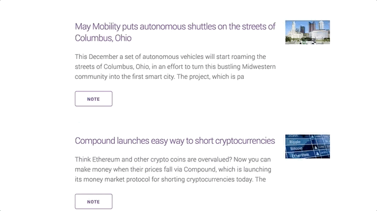

# Startup News Scraper

Startup News Scraper pulls in(by scraping) all of the newest and hottest startup news from Tech Crunch. You can then make notes about which startups you want to invest in!

[Live Site](https://startup-news-scraper.herokuapp.com/)

## Tech
- HTML
- CSS
- jQuery
- [Node.js](https://nodejs.org/en/) - Backend
- [Express](http://expressjs.com/) - Web framework
- [Handlebars](http://handlebarsjs.com/) - Template engine
- [Milligram](https://milligram.io/) - CSS framework
- [Axios](https://github.com/axios/axios) - Promise based HTTP client
- [Cheerio](https://github.com/cheeriojs/cheerio) - Scraping module
- [Mongo](https://www.mongodb.com/) - Database
- [Mongoose](https://mongoosejs.com/) - Mongo ODM

## Learning Points
This was my first time working with and deploying a Mongo database, and I have to say, it was an absolute delight to work with. Having only worked with relational databases before, Mongo was a bit of a shock. None the less I was extremely eager to dive in, and found that I was able to implement it with almost no pain points. The only issue I really had was wrapping my head around the concept rather than the tool, and coming to terms with the fact that it strays from the more "spreadsheet" like databases that I'm used to. Suffice it to say I will definitely be utilizing Mongo where ever I can in the future!

## Author
Craig Melville
